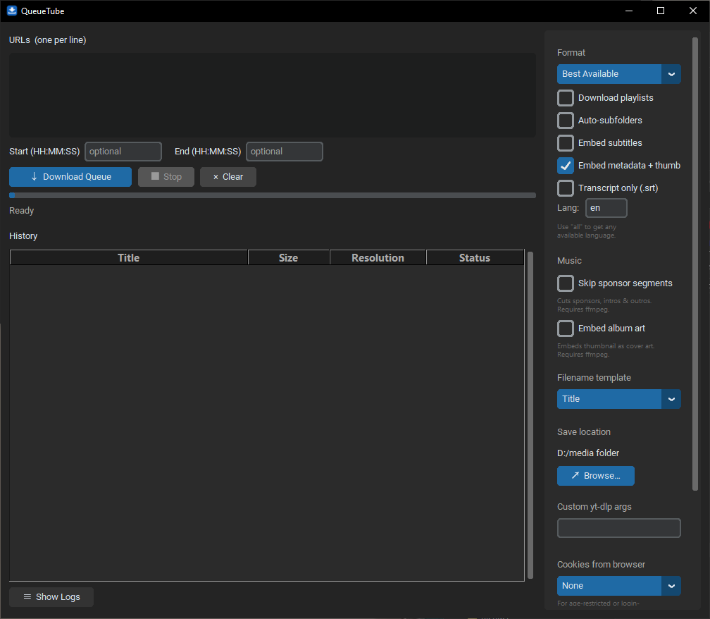

# QueueTube

A clean desktop GUI for [yt-dlp](https://github.com/yt-dlp/yt-dlp). Paste URLs, pick a format, download. No web server, no Electron — just a runnable Python app.

Works with YouTube, Vimeo, SoundCloud, and [1000+ other sites](https://github.com/yt-dlp/yt-dlp/blob/master/supportedsites.md) that yt-dlp supports.




## Features

**Download**
- Paste multiple URLs (one per line), download sequentially
- Format selection: Best Available, Best (MP4), 1080p, 720p, Audio Only (MP3) — with MP4-specific variants
- Optional time-slicing with start/end timestamps (type seconds like `130` and it auto-formats to `1:30`)
- Playlist support (opt-in)
- Auto-subfolders by uploader name
- Configurable filename templates (Title, Artist - Title, Uploader - Title)
- Thumbnails saved alongside videos for Explorer/Finder previews

**Music**
- Audio-only MP3 extraction
- SponsorBlock integration — auto-cuts sponsors, intros, and outros
- Embed album art (video thumbnail as MP3 cover)
- Artist - Title filename template for clean music libraries

**Subtitles & Transcripts**
- Embed subtitles into video files
- Transcript-only mode — downloads `.srt` files without the video
- Configurable language (defaults to English, supports "all" for every available language)

**Metadata & Privacy**
- Embed metadata and thumbnails
- Browser cookies for age-restricted or login-gated content (Chrome, Firefox, Edge, Brave, Safari, Chromium)
- No telemetry — only network calls are those made by yt-dlp itself

**UI**
- Live progress bar with download speed and ETA
- Window title updates during downloads (visible when minimised)
- Download history with right-click to open containing folder
- Collapsible raw log showing full yt-dlp output
- Scrollable settings sidebar
- Environment warnings for missing ffmpeg or JS runtime — with install commands shown inline
- Settings that require ffmpeg are greyed out when it's not installed
- URL validation and automatic deduplication

**Maintenance**
- Update yt-dlp from inside the app (one click)
- Remote JS solver checkbox — downloads YouTube challenge solver script from GitHub
- Custom yt-dlp args field for advanced users
- All settings persist to `config.json`

## Requirements

- **Python 3.10+**
- **[Deno](https://deno.com/)** — required for YouTube downloads (yt-dlp uses it to solve JS challenges)
- **[ffmpeg](https://ffmpeg.org/)** *(optional)* — needed for time-slicing, subtitles, metadata embedding, SponsorBlock, album art, and MP3 extraction

## Setup

### Windows

```bash
git clone https://github.com/FrostyCoderX/queuetube.git
cd queuetube
python -m venv venv
venv\Scripts\activate
pip install -r requirements.txt
```

### macOS / Linux

```bash
git clone https://github.com/FrostyCoderX/queuetube.git
cd queuetube
python3 -m venv venv
source venv/bin/activate
pip install -r requirements.txt
```

> **Note:** On some Linux distros you may need `python3-tk` installed for Tkinter support:
> `sudo apt install python3-tk` (Debian/Ubuntu) or `sudo dnf install python3-tkinter` (Fedora).

### Installing Deno (recommended)

```bash
# Windows
winget install DenoLand.Deno

# macOS
brew install deno

# Linux
curl -fsSL https://deno.land/install.sh | sh
```

### Installing ffmpeg (optional)

```bash
# Windows
winget install ffmpeg

# macOS
brew install ffmpeg

# Linux (Debian/Ubuntu)
sudo apt install ffmpeg
```

Restart the app after installing either — warning banners disappear automatically.

## Running

### Windows
Double-click `run.bat`, or:
```bash
venv\Scripts\activate
python main.py
```

### macOS / Linux
```bash
chmod +x run.sh    # first time only
./run.sh
```
Or manually:
```bash
source venv/bin/activate
python main.py
```

## Project Structure

```
queuetube/
├── main.py           # Entry point
├── app.py            # Root window, UI layout, event wiring
├── downloader.py     # yt-dlp integration, background thread, progress hooks
├── history.py        # Download history table (Treeview)
├── config.py         # Load/save config.json, format maps, defaults
├── icon.ico          # App icon (title bar + taskbar)
├── config.json       # Auto-generated settings (gitignored)
├── requirements.txt  # yt-dlp, customtkinter
├── run.bat           # Windows launcher
├── run.sh            # macOS / Linux launcher
├── CONTEXT.md        # Build log and decisions
└── BACKLOG.md        # Future ideas
```

## Platform Notes

| | Windows | macOS | Linux |
|---|---|---|---|
| Tested | Yes | No (should work) | No (should work) |
| Launcher | `run.bat` | `run.sh` | `run.sh` |
| Tkinter | Included | Included | May need `python3-tk` |
| Open folder | `os.startfile` | `open` | `xdg-open` |
| Icon | Title bar + taskbar | Title bar only | Depends on DE |

## Notes

- `config.json` is created on first run and stores your settings locally. It is gitignored.
- Downloads run sequentially in a single background thread — the UI stays responsive throughout.
- The Stop button halts the queue between URLs (won't kill a download mid-file).
- Duplicate URLs in the queue are automatically removed.
- Time-slicing cuts at the nearest keyframe for speed — cut points may be off by a few seconds.
- A thumbnail `.jpg` is saved alongside every download for file manager previews.
